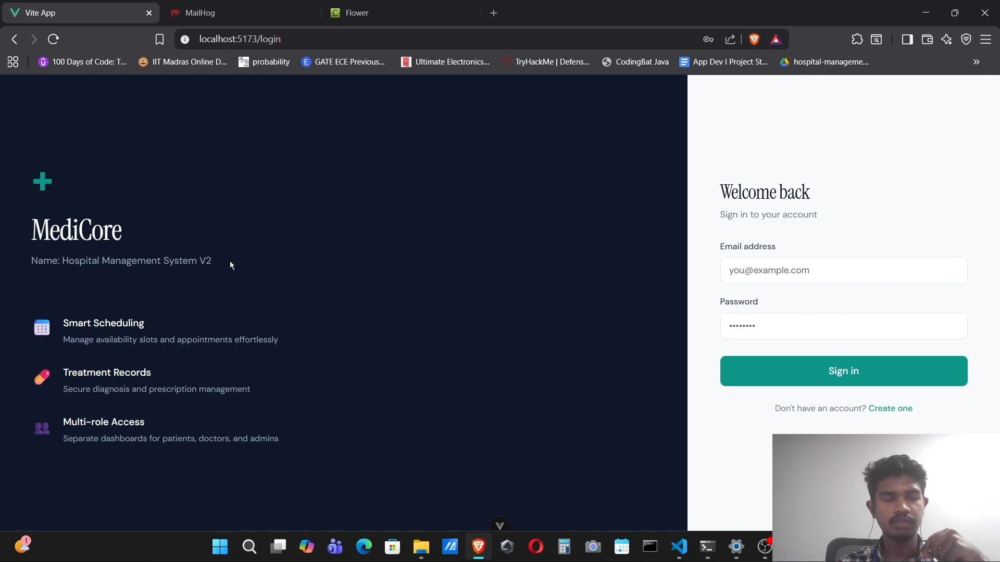
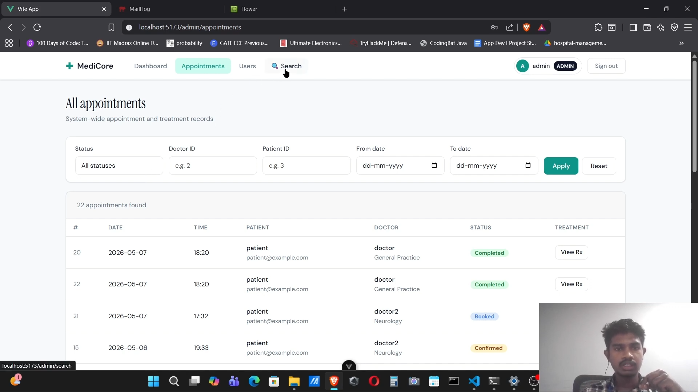
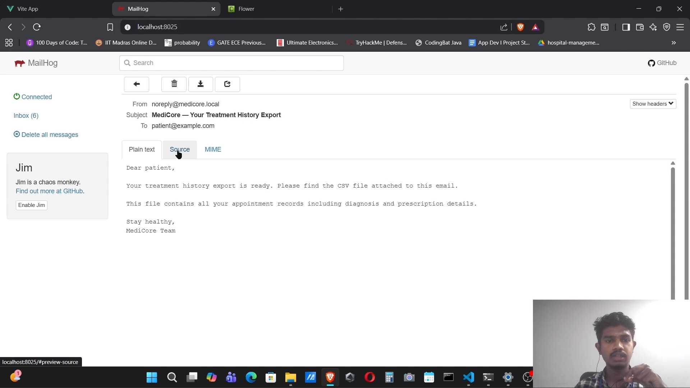
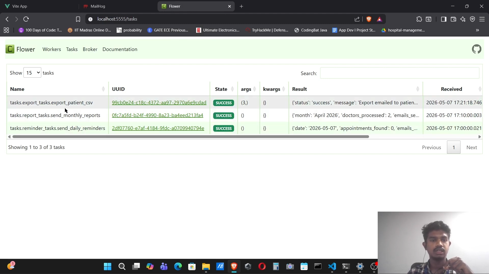
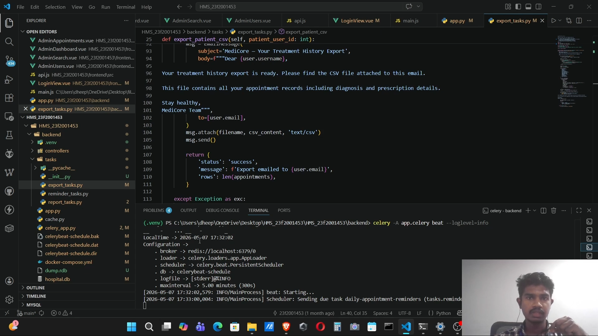

# 🏥 Medicore – Hospital Management System V2 (MAD-2)

Medicore is a modern full-stack Hospital Management System built using a **Vue.js frontend** and a **Flask REST API backend**. The application follows a decoupled architecture and incorporates asynchronous task processing, caching, scheduled jobs, and token-based authentication.

> Developed as part of the IIT Madras BS in Data Science – Modern Application Development II course.

---

## Features

- Token-based authentication
- Role-Based Access Control (RBAC)
- RESTful API architecture
- Appointment scheduling
- Doctor availability management
- Medical records management
- Background email reminders
- Monthly doctor reports
- Asynchronous CSV exports
- Redis caching
- Celery workers and scheduler
- Real-time task monitoring using Flower

---

## Tech Stack

### Frontend

- Vue.js 3
- Vue Router
- Pinia
- Vite

### Backend

- Flask
- Flask RESTful
- Flask Security Too
- Flask SQLAlchemy
- Flask Mailman

### Database

- SQLite

### Background Processing

- Redis
- Celery
- Celery Beat
- Flower

### DevOps

- Docker
- Docker Compose
- MailHog

---

## Screenshots








---

## API Overview

- Authentication APIs
- Admin APIs
- Doctor APIs
- Patient APIs
- Appointment APIs
- Export APIs

---

## Project Structure

```text
frontend/
backend/
redis/
celery/
docker-compose.yml
```

---

## Installation

```bash
git clone <repo-url>

docker-compose up

cd backend
pip install -r requirements.txt

python app.py

cd frontend
npm install
npm run dev
```

---

## Documentation

📄 Complete project documentation:

****

---

## Demo

🎥 Demo video:

****

---

## Author

**Dheepak D**

- LinkedIn: https://linkedin.com/in/devarajdheepakchakaravathi
- GitHub: https://github.com/DHEER-A
